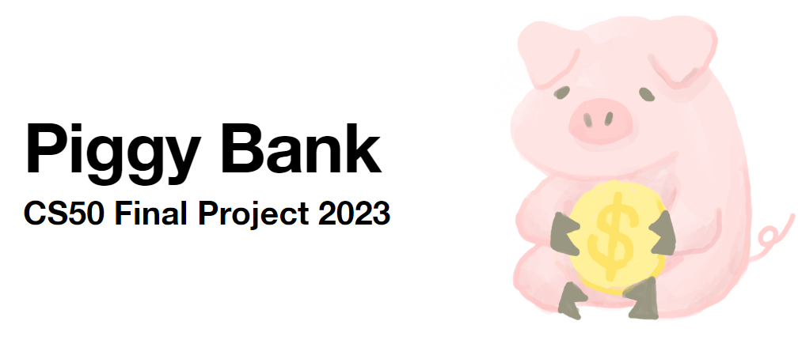

# Piggy Bank

#### Video Demo: https://youtu.be/__U8H2KLNM4

#### Description:



## Introduction

My project, **Piggy Bank**🐷, is a straightforward **expense tracking tool** 💰. It is divided into frontend and backend components. The frontend is developed using vue3, with UI enhancements from the Prime Vue components. The backend is built with Python and the Flask framework, providing APIs for frontend integration. The database utilizes sqlite and the Python sqlalchemy library.

The interface is designed for mobile use, aligning with the goal of quick and easy expense tracking. Users can swiftly input expenses by selecting a date and category, with the option to delete entries for error correction. Clicking on the "Month Report" in the navigation bar reveals spending, income, and category proportion details for each month.

This project delves into the vue3 frontend framework, and I learned how to work with various Python packages along my learning journey. Due to time constraints and my inexperience, some features remain unimplemented, such as record modification, leaving comments, and tagging system. Additionally, technical limitations stop me from realizing the frontend interface I imagined. 😓

Participating in the CS50 final project has been a rewarding experience, put what I've learned throughout the course into real use. While there are rooms for improvement and unimplemented features, Piggy Bank stands as a testament to my growth and understanding of software development. 😇

## Projejct Structure

```
├── piggy_bank_backend  -- Python backend
│   ├── app.py          -- flask app for backend API
│   ├── models.py       -- classes that uses sqlalchemy API to represent table in sqlite
│   └── user.py         -- unused file intended for handling multiple user login and registration
└── piggy_bank_frontend -- JavaScript frontend app
    ├── index.html      -- entry point for single page web application
    ├── package.json    -- npm packages, scripts, and project information
    ├── src
    │   ├── App.vue     -- VueJS root component of the entire app
    │   ├── assets      -- static files (css files)
    │   ├── components
    │   │   ├── CategorySelection.vue  -- component for multi-level category selection
    │   │   ├── DatePicker.vue         -- component for selecting date
    │   │   ├── MenuBottom.vue         -- app bottom navigation bar
    │   │   ├── NumberKeyboard.vue     -- component for input money
    │   │   ├── TransLog.vue           -- component for displaying records
    │   │   └── icons
    │   ├── main.js     -- mounting VueJS app root component
    │   └── views
    │       ├── MonthReport.vue        -- monthly report of spendings and income
    │       └── TrackExpenses.vue      -- page for record modification (insert, delete)
    └── vite.config.js  -- configuration for vite (build tool)
```

## How to Run

### Run Python server

```sh
$ flask run # Starts backend server
```

### Start frontend

Development

```sh
$ npm run dev # Serves frontend in development mode
```

Production

```sh
$ npm run build # Packages app in production mode
$ cd dist
$ python -m http.server # Serves static files built
```

Visit `localhost:8000/index.html` to use the app

## API

```python
@app.route("/categoryListGet", methods=["POST"])
def categoryListGet():
    '''
    Retrieve a multi-level list of categories based on the specified type.
    '''
```

```python
@app.route("/transLogsGet", methods=["POST"])
def transLogsGet():
    '''
    Fetch a list of transaction logs within a specified date range. Returns a list of transaction log objects.
    '''
```

```python
@app.route("/transLogSet", methods=["POST"])
def transLogSet():
    '''
    Create a new transaction log or update an existing one.Use the ID to determine the transaction log to update. If 0, a new transaction log will be created.Returns a JSON object with a message indicating success or an error.
    '''
```

```python
@app.route("/transLogDelete", methods=["POST"])
def transLogDelete():
    '''
    Delete a transaction log based on the transaction log id. Returns a JSON object with a message indicating success or an error.
    '''
```

```python
@app.route("/monthReportGet", methods=["POST"])
def monthReportGet():
    '''
    Generate a month-end report for the specified month. The returned object includes expenseAmount (total expenses), incomeAmount (total income), and balanceAmount (income - expenses).
    '''
```

```python
@app.route("/monthReportChartGet", methods=["POST"])
def MonthReportChartGet():
    '''
    Generate a bar chart of monthly spending categorized by type. Returns a JSON object containing the bar chart data.
    '''
```

## Design Choices

- Use Python for backend

  Python was chosen for the backend due to its familiarity from class teachings and the lightweight nature of the Flask framework.

- Use VueJS for frontend

  VueJS was selected for the frontend because of previous familiarity with the technology, and the desire to explore the newer Vue3 version.

- Mobile-based frontend interface

  Opting for a mobile-based frontend interface was motivated by the goal of providing a cross-device solution, enabling users to conveniently track expenses anytime, anywhere.
